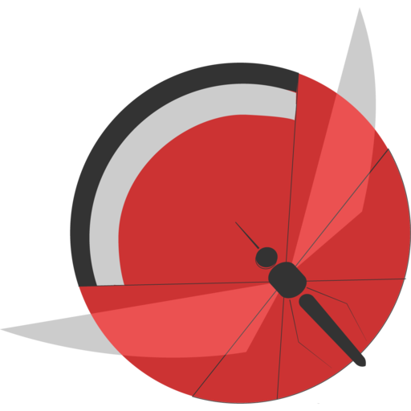

# iGEM-IISER-Pune-India

# Anopheles | The Half-Blood Princess




## Project Description

In January 2020, The World Health Organization estimated that 228 million people contracted Malaria globally, 405,000 people died from it in 2018 and accepted evidence for growing drug resistance against *Plasmodium falciparum* Malaria, especially in South-East Asia.[1] Our project aims to develop a library of inhibitory peptide (known for their high specificity and longer duration against drug resistance) drugs against essential Human-Parasite protein interactions. We intend to use **Cyclotides** (a type of stable plant proteins) as a protein scaffold for the delivery of these peptides. 

- Using Insilico modeling and simulations, our dry lab team has designed short peptides that will potentially inhibit the protein interactions crucial for the invasion and survival of malaria parasites inside a human host.
- Our wet lab team has designed various experiments to clone and express the interacting host and parasite proteins, characterize the drug and reduce the toxicity of the grafted cyclotide.
- To address issues related to poor diagnostics, we have developed a **Diagnostic tool** using **convolutional neural networks** and advanced deep learning algorithms to identify patients with malaria based on images of their blood smears.

All scripts, programs and description of software built and used for file processing, analysis, Molecular Dynamics simulation and Deep Learning algorithms  can be found on this repository. 

### Inhibitor peptide design

#### Overview 

We designed peptide inhibitors against essential *falciparum* membrane proteins and Human endothelial cell surface receptors using a Structural Biology and Bioinformatics approach. Detailed information on the workflow and questions answered can be found on our [modeling page](https://2020.igem.org/Team:IISER-Pune-India/Model). All files corresponding to this module of our project will be present in the ``` ./Peptides_against_Malaria``` directory and is assumed to be the root directory for the documentation in this section. In brief, the workflow involved : 

1. Literature Search and Mining the PDB database 

  We wrote ```RCSB_static_parser.py```, a web parser written in Python that statically mines the PDB database and returns all the required information in the form of a compact .csv file (or as preferred by the user). Although better commercial software are available, our web-parser is efficient, easy to handle and the output is most suitable for further analysis. We believe that this will greatly help future teams deal with the data deluge in biology and in particularly the RCSB Database.
  
2. PDB file Preprocessing and scoring

 Under ``` ./1_Preprocessing_and_scoring ``` we present the scripts we used to perform preprocessing, particularly, computational saturated mutagenesis, scoring of peptide inhibitors and how we analysed further data analysis. We have written our Python notebooks in a format that is easily readable to new teams and amateurs to help getting started with similar projects. 
  
3. Molecular Dynamics Simulations

  Under ``` ./2_MD_simulation_and_analysis ```, we have presented the scripts used to perform MD runs and and analyse the huge amounts of MD data ( $~$ 5-10 GB) for each inhibitor model using GROMACS 2019.1 on the Parambrahma Supercomputer. Our objective was to understand the behavior of the inhibitor over time, and determine the specific regions or atoms of the motif that are responsible for the binding. 

4. Circularising a Peptide in Cyclotides

We grafted our Peptide Inhibitor in loop 6 of Cycotide kalata B1. Th insilico modeling was performed using MODELLER [2] and few custom scripts. We found that such a circularization of a peptide grafted in a cyclotide (in-silico) was never performed. Therefore, we developed our own custom scripts and tested the stability of the drug (cyclotide + peptide Inhibitor) by Molecular Dynamics. More specifics on the method followed is on our [Grafting subpage](https://2020.igem.org/Team:IISER-Pune-India/Model#5) of the wiki. All files are at ``` ./3_cyclization```


## DeleMa Detect

### DEep LEarning for MAlaria Detection

DeleMa Detect is our Artificial Intelligence based **end-to-end Deep Learning software** for the diagnosis of Malaria through blood smear images. Our envisioned end-to-end diagnostics system consists of a Foldscope, an easy-to-assemble and very cheap optical microscope, a paper centrifuge that will help in creating the blood smear and this Web application that uses Python backend to classify blood smear images taken from any phone as infected or not. Our computational team has developed the deep learning software with an accuracy of ~96%. Our goal is to present a web application, that is fast on boot-time and processing without compromising on accuracy, so that it could be used on all kinds of mobile phones and in regions with poor internet connectivity as well.

Further documentation and tutorials on how to use it is under ``` ./DeLeMa_Detect ```. Detailed documentation on how the deep learning model build by a **Transfer Learning** algorithm using the **Mobilenet_v2 architecture** [3,4] is available on the [Software section](https://2020.igem.org/Team:IISER-Pune-India/Software) of our wiki. 

A miniature version of our Web application is already hosted on Heroku (a cloud based platform as a service) at [Delema-detect-igem-iiserpune](https://delema-detect-igem-iiserpune.herokuapp.com/). Some blood smear images for trial can be found on the [Software page](https://2020.igem.org/Team:IISER-Pune-India/Software) of our wiki.

### References : 

1. World Health Organization: WHO. (2020, January 14). Malaria. The World Health Organisation. https://www.who.int/news-room/fact-sheets/detail/malaria
2. A. Šali and T. L. Blundell. Comparative protein modelling by satisfaction of spatial restraints. J. Mol. Biol. 234, 779-815, 1993. 
3. Team, K. (2020, May 12). Keras documentation: Transfer learning & fine-tuning. Keras.Io. https://keras.io/guides/transfer_learning/
4.  MobileNetV2: The Next Generation of On-Device Computer Vision Networks. (2018, April 3). Google AI Blog. https://ai.googleblog.com/2018/04/mobilenetv2-next-generation-of-on.html


<br><br>
<br><br>
For clarifications and queries -- [iGEM-IISER-Pune](mailto:igem@sac.iiserpune.ac.in?subject=[igem20_github])@2020
